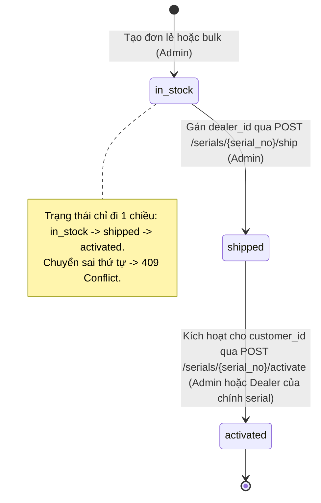

# Warranty API (Quản lý Serial & Bảo hành Thiết bị)

Dự án RESTful API backend chuyên biệt phục vụ quản lý vòng đời thiết bị điện tử, xuất kho đại lý, kích hoạt bảo hành và tra cứu thông tin bảo hành công khai. Được xây dựng theo kiến trúc hiện đại với **FastAPI**, **PostgreSQL 16**, **SQLAlchemy 2.0 (Mapped type annotations)**, **Alembic**, và **Docker Compose**.

---

## 1. Công nghệ Sử dụng (Tech Stack)

- **Ngôn ngữ**: Python 3.12 (type hint đầy đủ).
- **Web Framework**: FastAPI, Uvicorn.
- **ORM & Database**: SQLAlchemy 2.0 (`Mapped[...]`), PostgreSQL 16 (driver `psycopg` 3).
- **Migration**: Alembic.
- **Dữ liệu & Cấu hình**: Pydantic v2, `pydantic-settings`.
- **Xác thực & Bảo mật**: JWT (`PyJWT`), băm mật khẩu `bcrypt`.
- **Container hóa**: Docker, Docker Compose (services: `api`, `db`).
- **Kiểm thử**: `pytest`, `httpx` (TestClient) với database cô lập không ảnh hưởng dev DB.

---

## 2. Hướng dẫn Cài đặt & Chạy Dự án

### Cách 1: Khởi chạy bằng Docker Compose (Khuyên dùng - 1 lệnh duy nhất)

Yêu cầu máy đã cài đặt và khởi động **Docker Desktop**:

```bash
# 1. Clone hoặc chuyển vào thư mục dự án
cd D:\warranty-api

# 2. Tạo file cấu hình môi trường từ file mẫu
cp .env.example .env

# 3. Khởi động các dịch vụ (FastAPI + PostgreSQL 16)
docker compose up --build
```

- **Swagger UI Interactive API Docs**: Truy cập [http://localhost:8000/docs](http://localhost:8000/docs)
- **ReDoc API Documentation**: Truy cập [http://localhost:8000/redoc](http://localhost:8000/redoc)
- **Kiểm tra trạng thái hệ thống**: `GET http://localhost:8000/health` -> `{"status": "ok"}`

Chạy migration và seed dữ liệu mẫu trong container:
```bash
docker compose exec api alembic upgrade head
docker compose exec api python -m scripts.seed
```

---

### Cách 2: Chạy trực tiếp trên môi trường Local (Python Virtualenv)

```bash
# 1. Tạo môi trường ảo và cài đặt thư viện
python -m venv .venv
.\.venv\Scripts\activate
pip install -r requirements.txt

# 2. Thiết lập biến môi trường
cp .env.example .env

# 3. Chạy migration tạo bảng
alembic upgrade head

# 4. Khởi tạo dữ liệu mẫu (Admin, Dealers, Products)
python -m scripts.seed

# 5. Khởi động Web Server
uvicorn app.main:app --reload --port 8000
```

---

## 3. Tài khoản Mẫu (Seed Accounts)

Dữ liệu được tạo sẵn bởi script `scripts/seed.py`:

| Vai trò (Role) | Email | Mật khẩu | Quyền hạn |
| :--- | :--- | :--- | :--- |
| **Admin** | `admin@example.com` | `AdminPassword123!` | Toàn quyền: quản lý sản phẩm, đại lý, khách hàng, serials, người dùng |
| **Dealer** | `dealer@example.com` | `DealerPassword123!` | Đại lý Hà Nội: chỉ xem/kích hoạt serial của đại lý mình, tạo & xem khách hàng |
| **Công khai (Public)** | *(Không cần đăng nhập)* | *(Không cần)* | Tra cứu bảo hành `GET /warranty/{serial_no}` |

---

## 4. Sơ đồ Thực thể Liên kết (ER Diagram) & Bảng Dữ liệu

```mermaid
erDiagram
    USERS {
        int id PK
        string email UK
        string password_hash
        string role "admin | dealer"
        int dealer_id FK "nullable"
        bool is_active
        datetime created_at
    }
    PRODUCTS {
        int id PK
        string code UK
        string name
        int warranty_months "check > 0"
        datetime created_at
    }
    DEALERS {
        int id PK
        string name
        string phone
        string address
        datetime created_at
    }
    CUSTOMERS {
        int id PK
        string name
        string phone
        string email
        string address
        datetime created_at
    }
    SERIALS {
        int id PK
        string serial_no UK,IDX
        int product_id FK
        int dealer_id FK "nullable"
        int customer_id FK "nullable"
        string status "in_stock | shipped | activated"
        datetime shipped_at
        date activated_at
        date warranty_end
        datetime created_at
    }

    DEALERS ||--o{ USERS : "has"
    PRODUCTS ||--o{ SERIALS : "identified_by"
    DEALERS ||--o{ SERIALS : "shipped_to"
    CUSTOMERS ||--o{ SERIALS : "owned_by"
```

---

## 5. Quy tắc Nghiệp vụ & Vòng đời Serial



- **Tính duy nhất**: `serial_no` là duy nhất trên toàn hệ thống (trùng báo `409 Conflict`).
- **Bulk Creation**: Tạo nhiều serial cùng lúc theo tiền tố + dải số liên tiếp (tối đa 1000 serial mỗi lần, hỗ trợ padding số 0).
- **Ràng buộc xuất kho**: Chỉ được xuất kho (`ship`) đối với serial đang ở trạng thái `in_stock`.
- **Ràng buộc kích hoạt**: Chỉ được kích hoạt (`activate`) đối với serial đang ở trạng thái `shipped`.
  - Ngày kích hoạt (`activated_at`): mặc định hôm nay, không được ở tương lai (sai trả `400 Bad Request`).
  - Ngày hết hạn (`warranty_end`): tính tự động bằng `activated_at + warranty_months` của sản phẩm.
- **Bảo mật phạm vi đại lý (Dealer Scoping)**:
  - Đại lý chỉ nhìn thấy các serial thuộc về đại lý của mình.
  - Khi tra cứu danh sách hoặc chi tiết serial của đại lý khác -> trả về `404 Not Found` (coi như không tồn tại).
  - Đại lý cố tình kích hoạt serial không thuộc về mình -> trả về `403 Forbidden`.
- **Toàn vẹn dữ liệu tham chiếu**: Không cho phép xóa `Product`, `Dealer`, hoặc `Customer` nếu còn bản ghi `Serial` tham chiếu đến (trả `409 Conflict`). Không cho phép xóa `Dealer` nếu có `User` thuộc đại lý đó.
- **Tra cứu bảo hành công khai**: `GET /warranty/{serial_no}` không yêu cầu đăng nhập. Kết quả chỉ trả về tên sản phẩm, trạng thái, ngày kích hoạt, ngày hết hạn và `is_valid`. Tuyệt đối không để lộ bất kỳ thông tin cá nhân nào của khách hàng.

---

## 6. Danh sách API Endpoints

| Phương thức | Đường dẫn | Quyền hạn | Mô tả chức năng |
| :--- | :--- | :--- | :--- |
| `GET` | `/health` | Công khai | Kiểm tra sức khỏe dịch vụ (`status: ok`) |
| `POST` | `/auth/login` | Công khai | Đăng nhập nhận `access_token` JWT (thời hạn 60 phút) |
| `GET` | `/auth/me` | Đăng nhập | Xem thông tin tài khoản hiện tại |
| `GET` | `/products` | Đăng nhập | Danh sách sản phẩm có phân trang |
| `GET` | `/products/{id}` | Đăng nhập | Chi tiết sản phẩm |
| `POST` | `/products` | Admin | Tạo sản phẩm mới (`warranty_months > 0`) |
| `PUT` | `/products/{id}` | Admin | Cập nhật thông tin sản phẩm |
| `DELETE` | `/products/{id}` | Admin | Xóa sản phẩm (chặn xóa nếu có serial tham chiếu) |
| `GET` | `/dealers` | Đăng nhập | Danh sách đại lý có phân trang |
| `GET` | `/dealers/{id}` | Đăng nhập | Chi tiết đại lý |
| `POST` | `/dealers` | Admin | Tạo đại lý mới |
| `PUT` | `/dealers/{id}` | Admin | Cập nhật đại lý |
| `DELETE` | `/dealers/{id}` | Admin | Xóa đại lý (chặn xóa nếu có serial/user tham chiếu) |
| `GET` | `/customers` | Admin, Dealer | Danh sách khách hàng (tìm kiếm theo tên/sđt `?q=...`) |
| `GET` | `/customers/{id}` | Admin, Dealer | Chi tiết khách hàng |
| `POST` | `/customers` | Admin, Dealer | Tạo khách hàng mới |
| `PUT` | `/customers/{id}` | Admin | Cập nhật khách hàng |
| `DELETE` | `/customers/{id}` | Admin | Xóa khách hàng (chặn xóa nếu có serial tham chiếu) |
| `POST` | `/serials` | Admin | Tạo 1 serial mới (trạng thái `in_stock`) |
| `POST` | `/serials/bulk` | Admin | Tạo hàng loạt serial theo dải số (tối đa 1000) |
| `GET` | `/serials` | Đăng nhập | Danh sách serials (Dealer chỉ thấy của mình, lọc theo status, product, q) |
| `GET` | `/serials/{serial_no}` | Đăng nhập | Chi tiết serial (Serial đại lý khác coi như 404) |
| `POST` | `/serials/{serial_no}/ship` | Admin | Xuất kho cho đại lý (`in_stock` -> `shipped`) |
| `POST` | `/serials/{serial_no}/activate`| Admin, Dealer | Kích hoạt bảo hành cho khách (`shipped` -> `activated`) |
| `GET` | `/warranty/{serial_no}` | Công khai | Tra cứu bảo hành thiết bị, tính `is_valid`, ẩn thông tin khách |

*Quy ước định dạng:* Danh sách phân trang trả về dạng `{items: [...], total, page, size}`. Lỗi trả về dạng `{detail: "..."}`.

---

## 7. Chạy Kiểm Thử Tự Động (Automated Tests)

Bộ test bao gồm **22 unit & integration tests** bao phủ toàn bộ các phase, kiểm thử thành công, kiểm thử các ca vi phạm phân quyền, vi phạm trạng thái và tính toàn vẹn tham chiếu.

Kiểm thử sử dụng cơ sở dữ liệu in-memory độc lập (`sqlite:///:memory:` với StaticPool), hoàn toàn cô lập và không ảnh hưởng đến dữ liệu dev.

```bash
# Chạy toàn bộ test
pytest -v tests/
```

Kết quả:
```text
tests/test_auth.py (8 passed)
tests/test_crud.py (3 passed)
tests/test_database.py (3 passed)
tests/test_health.py (1 passed)
tests/test_serials.py (5 passed)
tests/test_warranty.py (2 passed)
======================= 22 passed in 100% =======================
```

---

## 8. Quyết định Thiết kế (Design Decisions)

1. **Driver Psycopg 3**:
   - Sử dụng chuẩn `postgresql+psycopg://` đồng bộ với SQLAlchemy 2.0 Engine và session context trong FastAPI.
2. **Kiến trúc Vòng đời Serial trong `serial_service`**:
   - Toàn bộ nghiệp vụ kiểm tra trạng thái và chuyển đổi được tập trung trong `app/services/serial_service.py` thay vì để ở controller/router, giúp code rõ ràng và dễ kiểm thử.
3. **Bảo mật Tra cứu Bảo hành**:
   - Serial thuộc đại lý khác khi đại lý tra cứu được trả về mã `404 Not Found` (thay vì 403), nhằm ngăn chặn đại lý dò quét mã serial của đại lý khác.
   - Endpoint tra cứu công khai `GET /warranty/{serial_no}` loại trừ hoàn toàn trường `customer_id` và các quan hệ khách hàng khỏi schema trả về.
4. **Tính toán Thời hạn Bảo hành Chính xác**:
   - Sử dụng thuật toán điều chỉnh lịch tự nhiên theo chu kỳ tháng (`calendar.monthrange`), đảm bảo khi kích hoạt vào ngày cuối tháng (ví dụ 31/01 sau 1 tháng) sẽ chuyển chính xác thành ngày cuối tháng tiếp theo (28/02 hoặc 29/02), không gây lỗi tràn ngày.
5. **Cơ chế Idempotent Seeding**:
   - Script `scripts/seed.py` kiểm tra sự tồn tại của Admin, Dealers và Products trước khi thêm mới, cho phép chạy nhiều lần mà không bị lỗi duplicate key.
